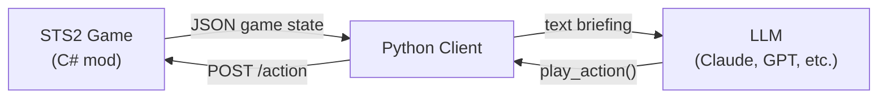

# STS2 Agent — LLM Plays Slay the Spire 2

An AI agent that plays [Slay the Spire 2](https://store.steampowered.com/app/2868840/Slay_the_Spire_2/) using large language models. A companion C# mod exposes game state and actions via HTTP; this Python client reads that state, renders it as text, and uses an LLM to make decisions — from playing cards in combat to choosing paths on the map.

The agent's gameplay is designed for livestreaming, with OBS overlay support to show the agent's reasoning and stats on stream.

## How It Works



1. When the game is waiting for player input, the mod serves the current game state as JSON over HTTP
2. This Python client fetches the state and renders it as a concise text briefing
3. The briefing is sent to an LLM, which decides which action to take via tool use
4. The client posts the chosen action back to the mod, and the loop repeats

The agent manages its own knowledge base across decisions and runs, building up strategic understanding over time. See [AGENT_DESIGN.md](AGENT_DESIGN.md) for the full architecture.

## Prerequisites

- **Slay the Spire 2** with the [STS2 Agent mod](https://github.com/wdong/sts2-ai-mod) loaded
- **Python 3.12+** with [uv](https://docs.astral.sh/uv/)
- An API key for at least one supported LLM provider

## Setup

```bash
# Install dependencies
uv sync

# Set your API key (for Claude)
export ANTHROPIC_API_KEY=sk-ant-...

# Or for OpenAI-compatible providers
export OPENAI_API_KEY=sk-...
```

## Usage

Start the game with the mod loaded, then run the client:

```bash
# LLM agent (default)
uv run python client.py --agent llm --model claude-sonnet-4-20250514

# Random agent (baseline, no API key needed)
uv run python client.py --agent random --speed fast

# With OBS overlay for streaming
uv run python client.py --agent llm --obs-password YOUR_OBS_WEBSOCKET_PASSWORD

# With logging to file
uv run python client.py --agent llm --log sts2agent.log
```

### Key Options

| Flag | Description |
|------|-------------|
| `--agent {random,llm}` | Agent type (default: `llm`) |
| `--model MODEL` | LLM model to use |
| `--speed {normal,fast}` | Action delay between moves |
| `--obs-password PW` | Enable OBS overlay via obs-websocket |
| `--log FILE` | Log output to file |

## Architecture

| File | Role |
|------|------|
| `client.py` | Main loop — poll state, render, decide, act |
| `api.py` | HTTP client for the mod's REST API (`localhost:57541`) |
| `state.py` | Typed dataclass model for game state snapshots |
| `renderer.py` | Renders game state into text briefings for LLM consumption |
| `llm.py` | Agent interface, RandomAgent, and LLMAgent |
| `backends.py` | LLM provider abstraction (Anthropic, OpenAI-compatible) |
| `prompts.py` | System prompt and strategy instructions |
| `i18n.py` | Translation layer (mod strings use the game's locale) |
| `obs.py` | OBS overlay integration via obs-websocket |
| `obs/` | Browser source assets for the OBS overlay |

## Agent Design

The LLM agent uses a tool-use loop: the model must call `play_action` to submit its decision, and can optionally call `update_knowledge_base` to persist strategic notes. Key features:

- **Conversation history with summarization** — full history is periodically compressed to stay within context limits while preserving strategic continuity
- **Two-level knowledge base** — an in-run KB for the current run's strategy, and a cross-run KB for lessons learned across games
- **Auto-resolve** — trivial decisions (proceed, claim gold/relics) are handled without LLM calls
- **Extended thinking** — where supported, the model's reasoning is extracted and displayed on stream
- **Model-agnostic** — works with any provider that supports tool use (Anthropic, OpenAI, etc.)

See [AGENT_DESIGN.md](AGENT_DESIGN.md) for the full design document.
